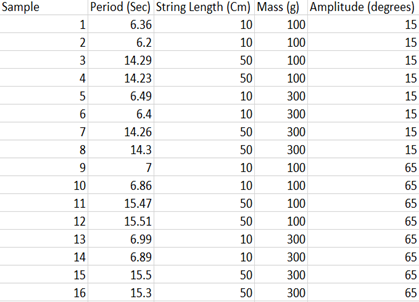
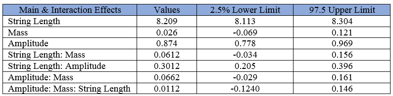
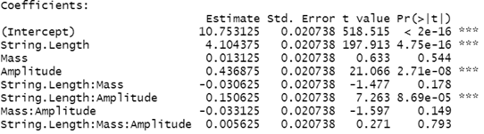
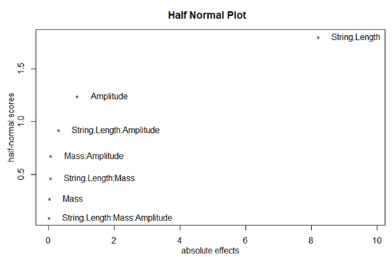

 # Let's Swing Into Factorial Designs!
## Introduction

After a long piano practice session using a metronome, I became quite curious about the inner workings of the metronome. More specifically, what were the factors which affected how fast this miraculous device swung? In order to deal with this curiousity of mine, I decided to perform a simple factorial design experiment. In this experiment, I wish to study the period of a pendulum; the period being the amount of time required for the pendulum to complete a full cycle. The pendulum consists of 2 main components: the weight/mass, and the element used to suspend this weight at a fixed point while allowing the weight to swing freely.

The 3 factors (with 2 levels each) which will be observed are the following:
  1. Mass  
    - High mass = 300g 
    - Low mass = 100g 
    
  2. String Length  
    - High length = 50cm  
    - Low length = 10cm
    
  3. Amplitude (drop angle)  
    - High amplitude = 65o  
    - Low amplitude = 15o
  
## Procedure and Data

In this experiment, one end of a string (length depends on the level we wish to observe) was taped down to the edge of a table. On the other end of the string, a container was attached such that the container could hold a variety of masses. It should be noted that the total masses were measured using a scale prior to being attached onto the pendulum. 

To start the first run of the experiment, a 100g mass was attached to a 10cm string. Next, with the use of a protractor, the weight was brought to an amplitude of 15o and released. As soon as the weight was dropped, a stopwatch was started to record the time taken to complete 10 full cycles (1 cycle = a full back and forth swing) and then recorded onto an excel spreadsheet. After the first run, we ran the experiment 7 more times while varying the string length, mass and amplitude each time. 

The whole procedure above was then replicated once more to create another 8 runs. Below, shows my general setup of the experiment, and the data collected on the excel spreadsheet.

**Note:** The data from the first run/trial are Samples 1,3,5,7,…,15

## Methods 
Due to the response variable being continuous, a linear model was fitted onto the full set of data points collected.Using this linear model, we have also created a half-normal plot to further observe which factors were most significant in this study. Furthermore, we can also describe the linear model by the following equation below:

Yi = β0 + β1S + β2M + β3A + β4SM + β5SA + β6AM + β7SMA + Ɛi where i represents the ith run 
-	Yi represents the period of the pendulum for the ith experimental run
-	S represents the pendulum’s String Length factor; with levels -1 = 10 cm and 1 = 50cm
-	M represents the pendulum’s Mass factor; with levels -1 = 100g and 1 = 300g
-	A represents the pendulum’s Amplitude; with levels -1 = 15 degrees and 1 = 65 degrees 
-	Ɛi is the error 

## Results
Upon viewing the 2 tables below, it is clear that both methods seem to suggest that a pendulum’s string length, amplitude, and their interaction has a significant effect on the period of the pendulum. In the first table, we see that the factors which do not include 0 are: string length, amplitude, and the string length & amplitude interaction. Similarly, in our linear model, the coefficients which have significant p-values (i.e. less that our significance level of 5%) are the same as the factors in the first table.

To further support the significance of these 3 effects, the half-normal plot below indicates that string length has the highest effect on the period. After string length, we see that amplitude has the second highest effect. And lastly, the interaction effect between the string length and the amplitude appears to have the least significant effect on the period; however, it is still more significant than the mass; mass & amplitude interaction; string length & mass interaction; and the 3-factor interaction effect. 

## Conclusion 

From our previous plot and tables, we have strong evidence to conclude that a pendulum’s period is primarily affected by its string length. In other words, a pendulum which is suspended by a longer string will have a larger increase in its period in comparison to a shorter string. Secondly, we have also observed that a pendulum’s amplitude can also have a significant effect on the period. By increasing the amplitude of the pendulum, we have seen that the period also increases; however, it is worth noting that the increase in the period is not as large here as it is in the previous case. Furthermore, if both the string length and amplitude are increased, we will see relatively small increases to the period (as seen from the calculated values and coefficients for the “String.Length: Amplitude” interaction effect in contrast to the main effects of string length and amplitude). Lastly, of the 3 factors which were analysed, only 1 of 3 factors were not significant. The mass of the pendulum appears to have no significant effect on the period, thus, the increase or decrease of the weight will not result in a big change to the period’s time.

## Note
Full detailed report can be found [here](https://github.com/William0n/Pendulum-Project/blob/master/Pendulum%20experiment%20report.pdf)
